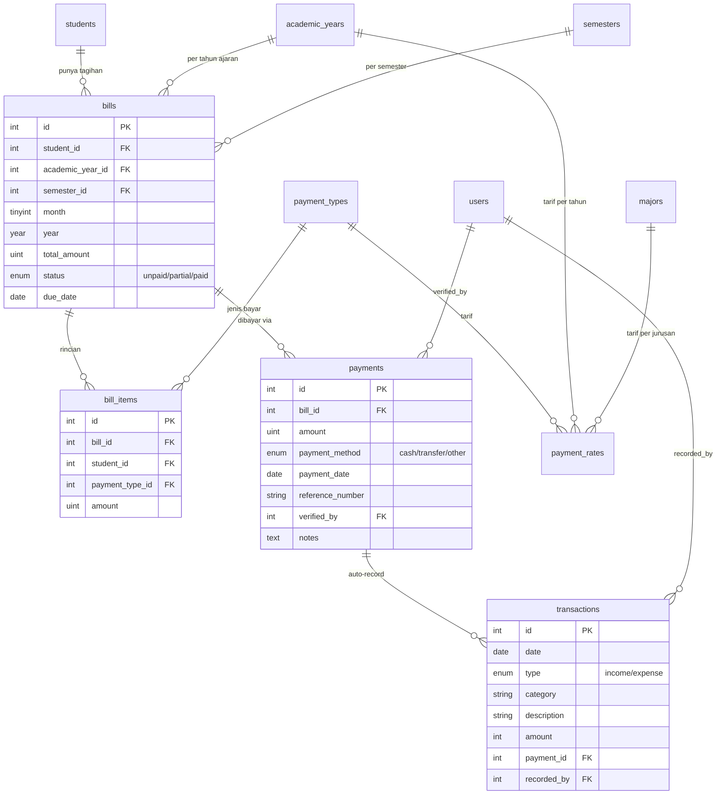
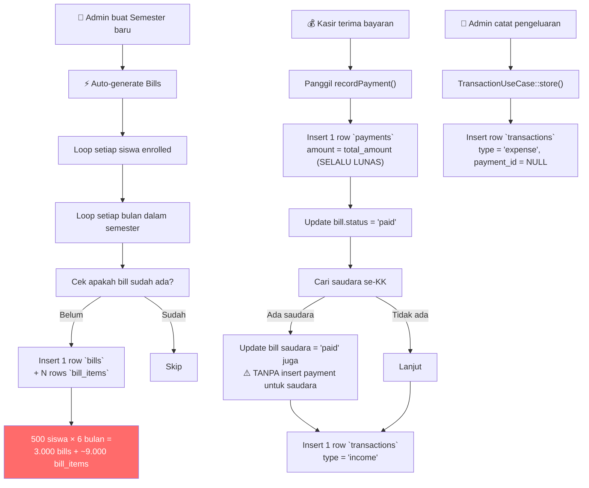
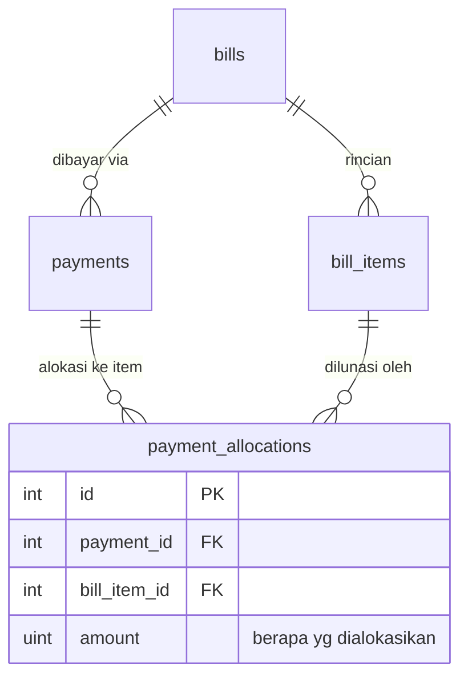
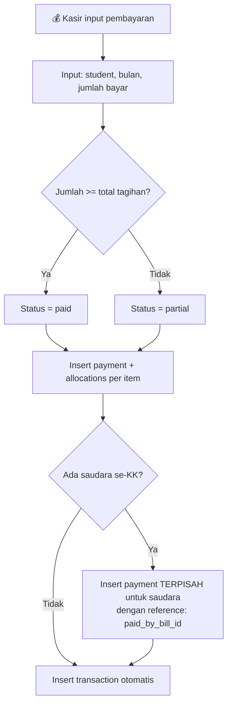
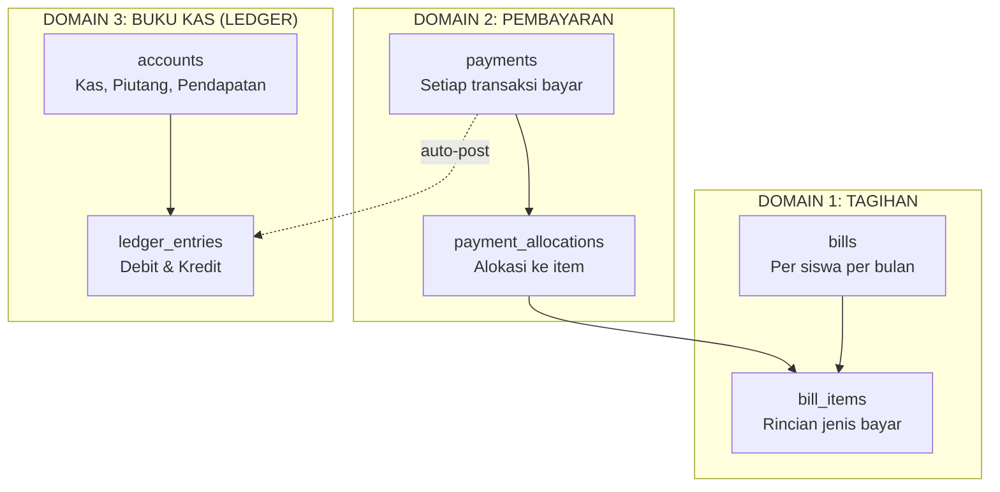
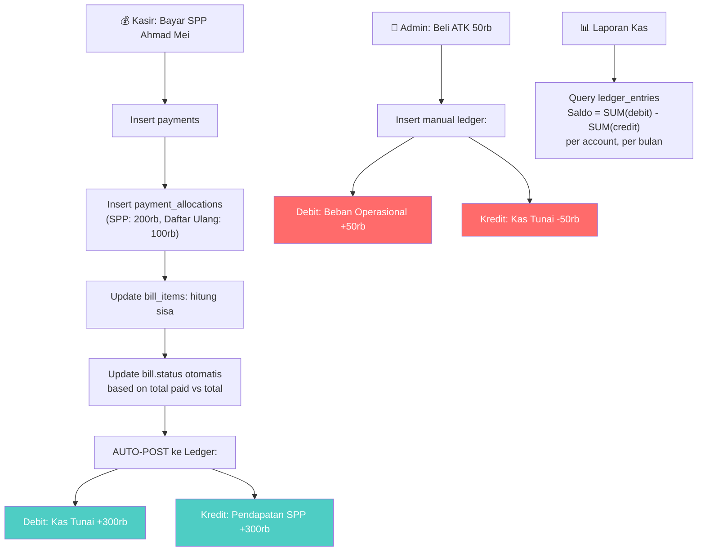
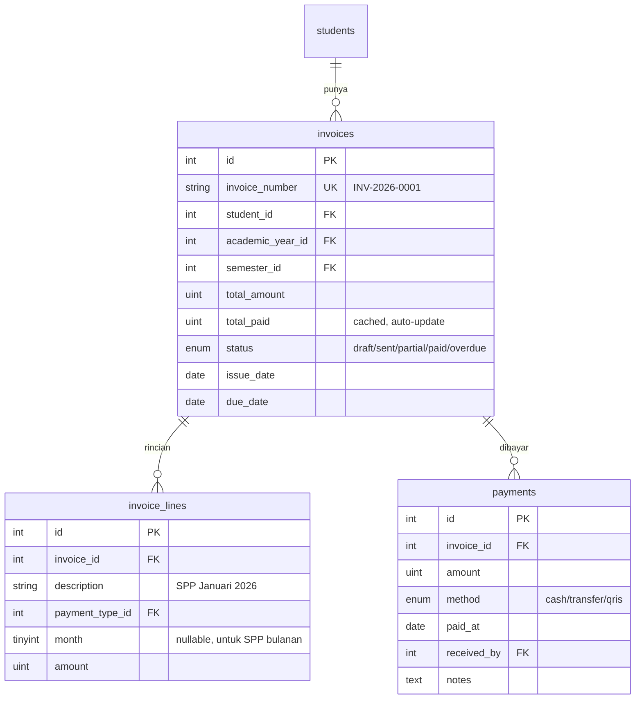
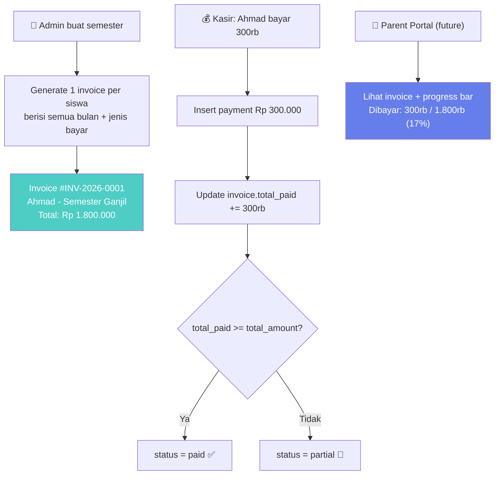

# 🔍 Analisis Sistem Pembayaran SAKTI
## Flow Sekarang vs Flow yang Seharusnya

---

## BAGIAN 1: KONDISI SEKARANG

### 1.1 Peta Tabel Keuangan Saat Ini

Sistem SAKTI punya **2 generasi** skema keuangan yang hidup berdampingan:

| # | Generasi LAMA (Feb 2026) | Generasi BARU (Mar 2026) |
|---|---|---|
| 1 | `spp_payments` — tagihan per No. KK | `bills` — tagihan per **siswa** per bulan |
| 2 | `payments_details` — link SPP → student | `bill_items` — rincian per jenis bayar |
| 3 | `transactions` → FK ke `spp_payment_id` | `payments` — record pembayaran |
| 4 | — | `transactions` → FK ke `payment_id` (modified) |

> [!WARNING]
> **Model `SppPayment` dan `PaymentsDetail` masih ada di codebase**, padahal tabel `bills` + `bill_items` + `payments` sudah menggantikan fungsinya. Model `Transaction` bahkan masih punya relasi ke `SppPayment` yang sudah tidak relevan.

### 1.2 ERD Kondisi Sekarang (Aktif Dipakai)



### 1.3 Flow Pembayaran Sekarang (Step-by-Step)



---

## BAGIAN 2: MASALAH-MASALAH YANG BIKIN RIBET

### Masalah #1: 🔴 Tabel Zombie (Hidup tapi Tidak Dipakai)

| Tabel/Model | Status | Masalah |
|---|---|---|
| `spp_payments` | ❌ Tidak dipakai | Masih ada migration & model `SppPayment` |
| `payments_details` | ❌ Tidak dipakai | Masih ada migration & model `PaymentsDetail` |
| `Student→paymentsDetail()` | ❌ Relasi mati | Student model masih punya relasi ke tabel lama |
| `Transaction→sppPayment()` | ❌ Relasi mati | Transaction model masih relasi ke SppPayment |

**Dampak:** Developer bingung pakai tabel yang mana. Rawan salah query.

---

### Masalah #2: 🔴 Tidak Bisa Bayar Cicilan

Lihat kode [recordPayment()](file:///d:/Matkul%20Semester%202/WORKSHOP%20ANALISIS%20DAN%20PERANCANGAN%20SISTEM%20INFORMASI/SAKTI/app/UseCases/BillUseCase.php#L283-L355):

```php
// Baris 301: amount SELALU = total_amount (lunas penuh)
'amount' => $bill->total_amount,

// Baris 312: langsung set 'paid'
'status' => 'paid',
```

> [!CAUTION]
> **Tidak ada mekanisme bayar sebagian (cicil).** Status `partial` ada di enum tapi tidak pernah digunakan. Kalau siswa mau bayar Rp 100.000 dari tagihan Rp 300.000, sistem tidak support.

---

### Masalah #3: 🔴 Saudara Gratis Tanpa Jejak

```php
// Baris 317-332: Saudara se-KK langsung ditandai 'paid'
DB::table('bills')
    ->whereIn('student_id', $siblingStudentIds)
    ->where('month', $bill->month)
    ->update(['status' => 'paid']);
// ⚠️ TIDAK ADA record payment untuk saudara!
```

**Dampak:**
- Bill saudara statusnya `paid` tapi **tidak ada bukti pembayaran**
- Laporan keuangan: uang masuk hanya tercatat 1x, tapi tagihan lunas untuk 3 anak
- Audit trail: *"Siapa yang bayar untuk anak ini?"* → Tidak ada jawabannya

---

### Masalah #4: 🟡 Buku Kas Campur Aduk

Tabel `transactions` mencampur:
- ✅ Income otomatis dari SPP (punya `payment_id`)
- ✅ Income/Expense manual (tidak punya `payment_id`)

Tapi **tidak ada konsep saldo berjalan (running balance)**, jadi:
- Mau tahu saldo kas hari ini? → Harus `SUM(income) - SUM(expense)` dari awal
- Mau audit per bulan? → Query berat
- Mau tahu kas per kategori? → Tidak ada struktur akun

---

### Masalah #5: 🟡 Pembayaran Tidak Tahu Bayar untuk Item Apa

Payment hanya tahu `bill_id`, tapi **tidak tahu bill_item mana yang dilunasi**:

```
Payment: Rp 300.000 → Bill #123
Bill #123 punya:
  - BillItem SPP: Rp 200.000
  - BillItem Daftar Ulang: Rp 100.000

Pertanyaan: SPP-nya sudah lunas? Daftar Ulang-nya sudah lunas?
Jawaban: ¯\_(ツ)_/¯ Tidak tahu, karena payment tidak di-link ke item spesifik.
```

---

### Masalah #6: 🟡 Volume Data Membengkak

Setiap semester generate:

```
500 siswa × 6 bulan = 3.000 bills
3.000 bills × 3 jenis bayar = 9.000 bill_items
Total per tahun (2 semester) = 6.000 bills + 18.000 bill_items
```

Ini tidak masalah secara performa database, tapi **secara operasional admin berat** kalau harus mereview ribuan row.

---

## BAGIAN 3: REKOMENDASI — 3 OPSI SOLUSI

---

### OPSI A: 🛠️ Quick Fix (Perbaiki yang Ada)

**Filosofi:** Pertahankan struktur `bills + bill_items + payments`, tapi perbaiki masalah-masalah kritis.

#### Yang Diubah:



#### Perubahan:

| # | Aksi | Detail |
|---|---|---|
| 1 | **Hapus tabel zombie** | Drop `spp_payments`, `payments_details`, hapus model & relasi |
| 2 | **Tambah `payment_allocations`** | Link payment → bill_item dengan jumlah spesifik |
| 3 | **Fix `recordPayment()`** | Support cicilan, hitung status otomatis (unpaid/partial/paid) |
| 4 | **Fix logika saudara** | Saudara tetap di-cover, tapi dengan payment record sendiri yang reference ke pembayar utama |

#### Flow Baru (Opsi A):



> **Effort:** ⭐⭐ (Sedang) — ~2-3 hari kerja
> **Risk:** ⭐ (Rendah) — Struktur inti tidak berubah

---

### OPSI B: 🏗️ Ideal — Double-Entry Ledger

**Filosofi:** Pisahkan "tagihan" dan "kas" menjadi 2 domain terpisah dengan konsep akuntansi proper.

#### Arsitektur Baru:



#### Tabel Baru — `accounts`:

| id | code | name | type |
|---|---|---|---|
| 1 | 1-100 | Kas Tunai | asset |
| 2 | 1-200 | Kas Bank/QRIS | asset |
| 3 | 4-100 | Pendapatan SPP | revenue |
| 4 | 5-100 | Beban Operasional | expense |

#### Tabel Baru — `ledger_entries`:

| id | date | account_id | debit | credit | payment_id | description |
|---|---|---|---|---|---|---|
| 1 | 2026-05-01 | 1 (Kas) | 300000 | 0 | 5 | SPP Mei - Ahmad |
| 2 | 2026-05-01 | 3 (Pendapatan) | 0 | 300000 | 5 | SPP Mei - Ahmad |
| 3 | 2026-05-02 | 4 (Beban) | 50000 | 0 | NULL | Beli ATK |
| 4 | 2026-05-02 | 1 (Kas) | 0 | 50000 | NULL | Beli ATK |

> [!IMPORTANT]
> **Setiap transaksi SELALU punya 2 entry (Debit = Kredit).** Ini standar akuntansi double-entry. Saldo kas = `SUM(debit) - SUM(credit)` pada account Kas.

#### Flow Lengkap (Opsi B):



> **Effort:** ⭐⭐⭐ (Tinggi) — ~5-7 hari kerja
> **Risk:** ⭐⭐ (Sedang) — Perlu migrasi data, tapi hasilnya sangat solid

---

### OPSI C: 💡 Radikal — Invoice-Based (Flat & Simpel)

**Filosofi:** Buang konsep "bill per bulan". Ganti dengan **invoice** yang fleksibel — bisa untuk 1 bulan, bisa untuk 1 semester sekaligus.

#### Ide Utama:

```
SEKARANG:    1 siswa × 12 bulan = 12 bills (+ 36 bill_items)
OPSI C:      1 siswa × 1 semester = 1 invoice (+ 6 line items untuk 6 bulan)
```

#### ERD:



#### Keuntungan Opsi C:

```
SEKARANG (500 siswa, 1 tahun):
  bills:      500 × 12 = 6.000 rows
  bill_items: 6.000 × 3 = 18.000 rows
  Total:      24.000 rows

OPSI C (500 siswa, 1 tahun):
  invoices:      500 × 2 semester = 1.000 rows
  invoice_lines: 1.000 × ~8 items = 8.000 rows
  Total:         9.000 rows (62% lebih sedikit!)
```

#### Flow (Opsi C):



> **Effort:** ⭐⭐⭐ (Tinggi) — ~5-7 hari kerja
> **Risk:** ⭐⭐⭐ (Tinggi) — Rewrite total modul keuangan

---

## BAGIAN 4: PERBANDINGAN KETIGA OPSI

| Kriteria | Opsi A (Quick Fix) | Opsi B (Ledger) | Opsi C (Invoice) |
|---|---|---|---|
| **Effort** | ⭐⭐ Sedang | ⭐⭐⭐ Tinggi | ⭐⭐⭐ Tinggi |
| **Cicilan** | ✅ Ya | ✅ Ya | ✅ Ya |
| **Audit Trail** | ✅ Baik | ✅✅ Sangat Baik | ✅ Baik |
| **Laporan Keuangan** | 🔶 Cukup | ✅✅ Profesional | ✅ Baik |
| **Saudara se-KK** | ✅ Fix | ✅ Fix | ✅ Fix |
| **Volume Data** | 🔶 Tetap banyak | 🔶 Tetap + ledger | ✅ Jauh lebih sedikit |
| **Parent Portal** | 🔶 Bisa | ✅ Bisa | ✅✅ Sangat cocok |
| **Skalabilitas** | ✅ Cukup | ✅✅ Sangat baik | ✅✅ Sangat baik |
| **Kompleksitas Kode** | ⭐ Rendah | ⭐⭐⭐ Tinggi | ⭐⭐ Sedang |

---

## BAGIAN 5: REKOMENDASI SAYA

> [!TIP]
> ### Rekomendasi: **Opsi A sekarang, lalu upgrade ke Opsi B nanti**
>
> 1. **Sekarang → Opsi A:** Bersihkan tabel zombie, tambah payment_allocations, fix cicilan & saudara. Ini yang paling **aman dan cepat**.
>
> 2. **Phase 2 → Tambah Ledger (Opsi B):** Saat modul keuangan sudah stabil dan mau masuk fitur laporan keuangan/audit, tambahkan layer ledger di atas Opsi A.
>
> 3. **Opsi C** bagus secara konsep tapi berisiko tinggi karena rewrite total. Cocok kalau memang mau rebuild dari nol.

### Prioritas Immediate (Yang Harus Dilakukan Sekarang):

1. ❌ **Hapus** model `SppPayment`, `PaymentsDetail` dan migrasinya
2. ❌ **Hapus** relasi `Student→paymentsDetail()` dan `Transaction→sppPayment()`
3. ✅ **Tambah** tabel `payment_allocations`
4. ✅ **Fix** `recordPayment()` supaya support cicilan
5. ✅ **Fix** logika saudara se-KK supaya ada payment record yang jelas

---

*Dokumen ini dibuat berdasarkan analisis codebase SAKTI per 11 Mei 2026.*
